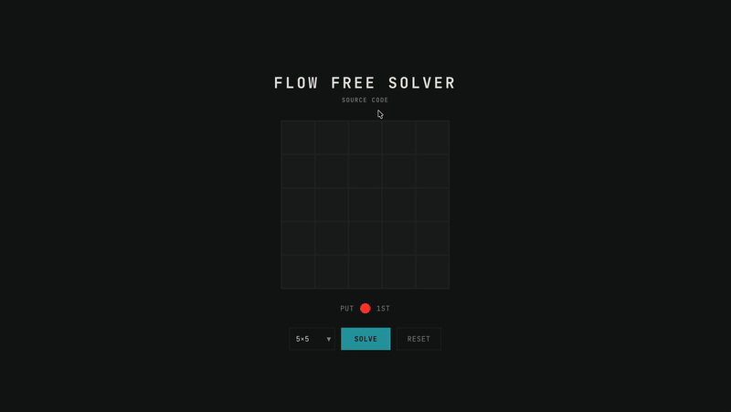

# Flow Free Solver

**Flow Free Solver** (also known as a **Number Link Solver**) is a high-performance web tool that **solves complex logic puzzles in milliseconds** locally in your browser. Built with **React** and **WebAssembly**, it uses advanced constraint solving algorithms (*Z3 Theorem Prover* and *A\**) to find solutions for grids ranging from 5x5 to 15x15 without sending data to a server.



[](https://flow.kongesque.com/)
[](https://www.kongesque.com/)
[](https://reactjs.org/)
[](https://vitejs.dev/)

### 🧩 What is Flow Free?
Flow Free (classically known as **Number Link**) is a logic puzzle where players must connect colored dots on a grid.
The rules seem simple, but the puzzle becomes exponentially harder as the grid size increases:
1.  **Connect Matching Colors**: Draw a pipe to pair every matching color (e.g., Red to Red).
2.  **No Crossings**: Pipes cannot cross or overlap each other.
3.  **Fill the Board**: **Critical!** You must occupy every single square on the grid. A solution is only valid if there are no empty spaces left.

While 5x5 grids are trivial, **15x15 grids** require finding a specific Hamiltonian-like path that satisfies global constraints, making it a classic NP-complete problem for computers.

Try it online: **[https://flow.kongesque.com/](https://flow.kongesque.com/)**

## 🔬 Algorithms Used

| Algorithm | Type | Description |
|-----------|------|-------------|
| [Z3 Theorem Prover](https://github.com/Z3Prover/z3) | SAT/SMT Solver | Microsoft Research's industrial-strength constraint solver, compiled to WebAssembly |
| [A* Search Algorithm](https://en.wikipedia.org/wiki/A*_search_algorithm) | Heuristic Search | Pathfinding with Manhattan distance heuristic and lookahead pruning |
| [Heuristic BFS](https://mzucker.github.io/2016/08/28/flow-solver.html) | Algorithm Search | Optimized C++ implementation of Breadth-First Search with domain-specific heuristics, compiled to WebAssembly |

> **Key Takeaway**: While A* is faster for trivial puzzles, **Z3 (SAT)** scales far better for complex grids, solving problems in milliseconds that would take standard pathfinding algorithms eons.

## ✨ Key Features

- **Instant AI Solutions**: Solves complex Number Link puzzles in milliseconds using the Z3 SMT Solver (compiled to Wasm).
- **Interactive Editor**: Draw your own puzzles or test specific configurations on grids up to 15x15.
- **Multiple Algorithms**: Compare the performance of heuristic search (A*), constraint satisfaction (SAT), and optimized C++ BFS.
- **Visual Paths**: See the solution animated in real-time.

---

## 🎮 How to Use

1.  **Select Grid Size**: Choose a size from 5x5 to 15x15.
2.  **Paint the Board**: Click an empty cell to place a color. Click again to visualize the path.
    - *Tip*: You need exactly two dots of the same color to form a pair.
3.  **Click Solve**: The AI will instantly calculate the non-overlapping paths.

---

## 🧠 Technical Architecture

This project is a showcase of bringing competitive programming algorithms to the client-side web.

### Method 1: Z3 SAT Solver
We treat the puzzle as a **Constraint Satisfaction Problem (CSP)**. By compiling the Microsoft Z3 Theorem Prover to WebAssembly, we can run industrial-strength logic solving directly in the browser without a backend.
- **Constraint 1**: Every cell must have a color or be empty (initially).
- **Constraint 2**: Every color endpoint has exactly one neighbor of the same color.
- **Constraint 3**: Every path cell has exactly two neighbors of the same color (flow conservation).

### Method 2: Heuristic Search (A*)
A traditional graph search approach:
- **Path Construction**: BFS explores potential routes.
- **Heuristics**: A* estimates the remaining distance (Manhattan distance) to guide the search.
- **Pruning**: `lookaheadHeuristics` discard invalid states early (e.g., if a color gets trapped).

### Method 3: Heuristic BFS 
An optimized solver (based on [Matt Zucker's flow_solver](https://mzucker.github.io/2016/08/28/flow-solver.html)) written in C++ and compiled to WebAssembly. It achieves extreme performance through advanced pruning techniques:

-   **Active Color Selection**: At each step, it only moves the "most constrained" color (the one with the fewest valid moves), drastically reducing the search tree size.
-   **Dead-End & Stranding Checks**: It immediately discards states where a color is cut off from its goal or a region of the board becomes unreachable (using connected component labeling).
-   **Forced Moves & Fast-Forwarding**: If a color has only one valid move, it is taken automatically (zero cost). Chains of forced moves are "fast-forwarded" without clogging the search queue.
-   **Chokepoint Detection**: It identifies narrow passages that would inevitably block other colors, pruning those branches early.

---

## 🚀 Local Development

### Prerequisites
- Node.js 18+ and npm

### Installation
```bash
git clone https://github.com/Kongesque/Flow-Free-Solver.git
cd Flow-Free-Solver
npm install
```

### Commands
| Command | Description |
|---------|-------------|
| `npm start` | Start local dev server |
| `npm run build` | Build for production |
| `npm run deploy` | Deploy to GitHub Pages |

---

## 🌐 Live Deployment

**[Flow Free Solver Live Demo](https://flow.kongesque.com/)**

---

## 📄 License


This project is open source under the [MIT License](LICENSE).

**Exception:** The "Heuristic BFS" solver module is based on [flow_solver](https://github.com/mzucker/flow_solver) by Matt Zucker and is licensed under **[CC BY-NC 2.0](https://creativecommons.org/licenses/by-nc/2.0/)**. This exception explicitly applies to:
- `public/wasm/flow_solver_c.js`
- `public/wasm/flow_solver_c.wasm`
- The integration logic for `solveHeuristicBFS` in `src/solver/workers/solver.worker.ts` 

If you use this project for commercial purposes, you must exclude the Heuristic BFS solver module or obtain a separate license from the original author.

Created by **[Kongesque](https://www.kongesque.com/)**.
